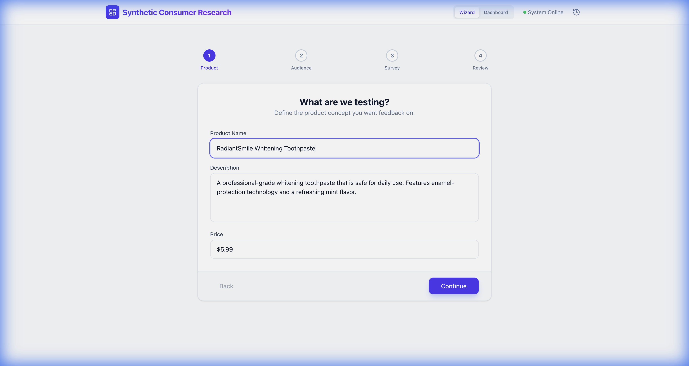
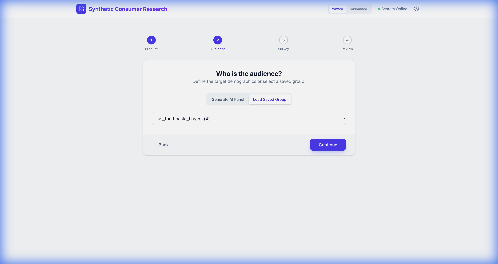
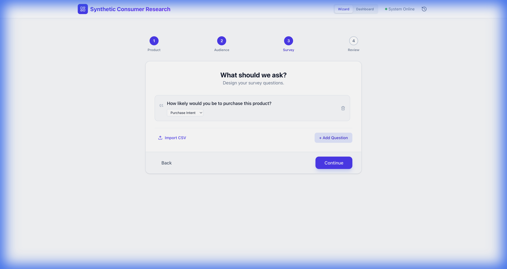
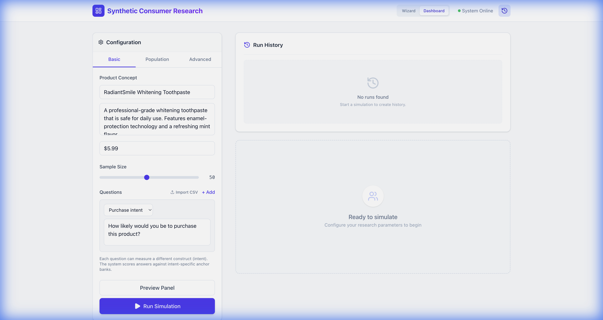

# Synthetic Consumer Research Service
[](https://deepwiki.com/strangeloopcanon/llm-consumer-research)

Imagine you have a new product idea. Instead of spending weeks and thousands of dollars on traditional focus groups, you can use this tool to get instant feedback from a virtual panel of consumers. This helps you make better decisions, faster.

## Who is this for?

*   **Product Managers & Marketers:** Quickly test new product concepts, messaging, or pricing.
*   **Researchers & Analysts:** Augment traditional research methods with rapid, cost-effective synthetic data.
*   **Anyone who needs to understand a target audience deeply and quickly.**

## Why does this exist?

*   **Traditional consumer research is slow and expensive.** Finding the right people, running surveys, and analyzing data can take a long time and a lot of money. This often leads to teams skipping research and relying on gut instinct.
*   **AI can be a powerful research tool, but it needs to be used correctly.** You can't just ask a chatbot "Would you buy this product?". The answers are often unreliable. Our service uses a disciplined, structured approach to ensure the results are trustworthy.
*   **We're creating a new standard for rapid insights.** This project provides a reliable, transparent, and auditable way to use AI for consumer research.

## How it works: A virtual focus group

Think of our service as a highly advanced virtual focus group. Here’s a simplified look at how it works:

1.  **You provide the product idea.** This can be as simple as a short description, a product title, and a price. You also tell us who your target audience is (e.g., "health-conscious moms" or "tech-savvy students").
2.  **We create "AI personas".** Based on your target audience, we create a panel of virtual consumers. These AI personas are designed to think and behave like real people from that demographic.
3.  **The AI personas "react" to your idea.** Each AI persona provides feedback on your product concept, explaining what they like, what they don't like, and why.
4.  **We analyze the feedback.** We process all the qualitative feedback and translate it into easy-to-understand charts and summaries, like purchase intent scores (e.g., "7 out of 10 would buy").

The result is a rich, detailed report that tells you not just *what* your target audience thinks, but *why* they think it.

## What you get out of the box

*   **Clear, actionable insights:** See how likely your target audience is to buy your product, with easy-to-read charts and scores.
*   **Qualitative feedback:** Understand the "why" behind the scores with concise summaries of the AI personas' reasoning.
*   **Flexible and easy to use:** Interact with the service through a simple web interface, a command-line tool, or by integrating it into your own applications.
*   **Trustworthy and transparent:** Our methods are designed to be reliable and reproducible, with clear documentation on how the AI models are used.

---
## Technical Details

For our technical users, here's a deeper dive into the implementation.

### How the engine works (technical version)

1.  **Ingest the concept.** We accept free-text copy or fetch a URL, normalize the payload, and build a prompt block with provenance.
2.  **Elicit synthetic respondents.** For each persona, a Large Language Model (LLM) roleplays realistic rationales with enforced JSON outputs, caching, and retry controls.
3.  **Map rationales to Likert space.** Semantic Similarity Rating (SSR) embeds each rationale against curated anchor banks, averages across variants, and aggregates to personas and overall distributions.

The result is a transparent pipeline: every decision—persona weights, anchors, models, retry budget—is versioned and auditable.

### Run it locally (One-Shot)

The easiest way to start the complete environment (Backend + Frontend) is with the provided script:

```bash
chmod +x dev.sh
./dev.sh
```

This will:
1.  Create and activate a Python virtual environment (`.venv311`)
2.  Install all backend dependencies
3.  Install frontend dependencies
4.  Start the FastAPI backend (port 8000)
5.  Start the Vite frontend (port 5173) and open it in your browser

### Manual Startup

If you prefer to run services individually:

**Backend:**
```bash
python3.11 -m venv .venv311
source .venv311/bin/activate
pip install -e .
uvicorn ssr_service.api:app --host 0.0.0.0 --port 8000 --reload
```

**Frontend:**
```bash
cd web_ui
npm install
npm run dev
```

### New Features

#### 1. Wizard Mode (Guided Setup)
A step-by-step interface to guide you through creating a simulation. Perfect for first-time users.


#### 2. Audience Builder
Generate a representative synthetic panel from your own real-world data.
-   Navigate to the **Audience** step.
-   Select **Generate AI Panel** or **Load Saved Group**.
-   The system uses an LLM to analyze your description or uploaded evidence to synthesize a `PopulationSpec`.


#### 3. Survey Design & CSV Import
Clearly define your questions. You can now import questions directly from a CSV file.


#### 4. Run History & Persistence
Every simulation is automatically saved. Toggle the "History" icon in the dashboard to access past runs.


### Example request

```bash
curl -X POST http://localhost:8000/simulate \
  -H "Content-Type: application/json" \
  -d '{
    "concept": {
      "text": "A premium whitening toothpaste with enamel-safe ingredients and a refreshing mint flavor.",
      "title": "RadiantSmile Whitening Toothpaste",
      "price": "$5.99"
    },
    "personas": [
      {
        "name": "Emily",
        "age": "34",
        "gender": "female",
        "region": "US",
        "income": "Upper middle",
        "descriptors": ["health-conscious", "busy mom"],
        "weight": 0.6
      }
    ],
    "options": {"n": 25}
  }'
```

The response includes:

- Per-persona Likert pmf, mean, top-2 box, rationales, and key themes.
- Aggregate distribution weighted by persona weights.
- Metadata describing the prompt, anchor bank, and bootstrap CIs for the average score.
- Persona summaries that highlight the segment backgrounds powering the simulation.
- `metadata.run_id`: The unique ID of the persisted run.

### Anatomy of the repo

- `src/ssr_service/api.py` – FastAPI surface exposing `/health` and `/simulate`.
- `src/ssr_service/orchestrator.py` – the heart of the pipeline (ingestion → elicitation → SSR → aggregation).
- `src/ssr_service/elicitation.py` – Responses API client with JSON-mode prompts, caching, and retry guards.
- `src/ssr_service/ssr.py` / `embedding.py` – anchor management and cosine-similarity mapping for Likert distributions.
- `src/ssr_service/personas.py` – persona library loader, CSV ingestion, and weight normalization for stratified samples.
- `src/ssr_service/data/anchors/purchase_intent_en.yml` – versioned anchor banks; extend these to add new intents.
- `src/ssr_service/data/personas/*.yml` – ACS-derived personas you can override or replace.

- `scripts/generate_gov_personas.py` – reproducible persona regeneration straight from the U.S. Census Bureau ACS API.
- `tests/` & `tests_llm_live/` – unit tests plus golden-schema validation for live LLM runs.

### Configuration

- `OPENAI_API_KEY` – required for OpenAI models.
- `ANTHROPIC_API_KEY` – required for Anthropic (Claude) models.
- `GOOGLE_API_KEY` – required for Google (Gemini) models.
- `PERPLEXITY_API_KEY` – required for Perplexity models.
- `OPENAI_BASE_URL` – optional custom endpoint.
- `RESEARCH_MODEL` – overrides the default OpenAI model (default `gpt-5`).
- `ANTHROPIC_MODEL` – overrides the default Anthropic model (default `claude-3-5-sonnet-20241022`).
- `GEMINI_MODEL` – overrides the default Gemini model (default `gemini-1.5-pro`).
- `PERPLEXITY_MODEL` – overrides the default Perplexity model (default `llama-3.1-sonar-large-128k-online`).
- `OPENAI_EMBEDDING_MODEL` – embedding model (default `text-embedding-3-small`).
- `ANCHOR_BANK_PATH` – directory containing anchor YAML files.
- `PERSONA_LIBRARY_PATH` – directory containing persona library YAML files.

All settings are loaded via `pydantic-settings`; `.env` in the repo root is respected.

### Multi-Model Support

You can now query multiple LLM providers in a single simulation. Supported providers are:
- `openai`
- `anthropic`
- `gemini`
- `perplexity`

To use them, ensure the corresponding API keys are set in your environment or `.env` file.

**CLI Usage:**
Use the `--provider` flag (repeatable) to specify which providers to use.

```bash
python -m ssr_service.simple_cli \
  --concept-text "My product" \
  --provider openai \
  --provider anthropic \
  --samples-per-persona 10
```

**API Usage:**
Include the `providers` list in the `options` object:

```json
{
  "options": {
    "n": 50,
    "providers": ["openai", "anthropic", "gemini"]
  }
}
```

### Advanced Simulation Features
181: 
182: The service now supports advanced controls for more nuanced simulations:
183: 
184: *   **Dynamic Population Generation:** Instead of static lists, generate personas on the fly using natural language descriptions (e.g., "Eco-conscious moms in Seattle").
185: *   **Temperature Control:** Adjust the `temperature` (0.0 - 2.0) to control the creativity and variance of the LLM responses.
186: *   **Context Injection:** Provide `additional_instructions` to give the LLM more context about the simulation scenario (e.g., "Assume a recession economy").
187: 
188: These features are available in both the Web UI (under "Population" and "Advanced" tabs) and the API/CLI.
189: 
190: ### Personas and sampling

- Built-in persona groups live in `src/ssr_service/data/personas`. Each YAML notes the ACS table sources. Provide `persona_group` (e.g. `us_toothpaste_buyers`, `us_backpack_buyers`) to seed the request with those weighted personas.
- Provide `persona_csv` to define custom segments. Columns can include demographics (`name`, `age`, `gender`, `region`, `income`, `occupation`, `education`, `household`), behavioural lists (`habits`, `motivations`, etc.), and `weight`. Unsupported columns are ignored.
- Sampling knobs: `options.n` (per-persona respondents), `options.total_n` + `options.stratified` for weighted allocation, and `sample_id` to load a demo scenario from `demo_samples.json`.
- For a full walkthrough of filters, generation prompts, injections, population specs, raking, and the multi-question loop, see [Persona Composition & Question Flow](docs/persona_overview.md).

#### Example scenarios for Gradio

1. **Toothpaste concept with eco-conscious professionals**
   - Sample Scenario: `Fjallraven - Foldsack No. 1 Backpack` (just to populate fields, then adjust).
   - Concept Title: `RadiantSmile Whitening Toothpaste`
   - Price: `$5.99`
   - Description: copy/paste your product blurb.
   - Persona Library Group: `us_toothpaste_buyers`
   - Advanced Persona Controls:
     - Persona Filters: `group=us_toothpaste_buyers;include.age=25-44;share=0.4`
     - Persona Generation Prompts: `prompt=Eco-conscious professionals;count=2;share=0.3;attr.region=US`
     - Persona Injections: `name=Loyal Subscriber;descriptors=subscription,auto-ship;share=0.2`
     - Additional Questions:
       - `What would convince you to switch from your current toothpaste?`
   - Samples per Persona: `50`
   - Total Samples: `200`
   - Stratified Allocation: checked
   - Custom Intent Question: `How likely would you be to purchase this toothpaste during your next grocery trip?`

2. **Digital banking feature launch**
   - Concept Title: `SpendSense - Automated Expense Coach`
   - Price: `Subscription $4.99/month`
   - Description: *"AI coach that monitors transactions across your linked accounts, flags anomalies, and gives weekly savings nudges tailored to your goals."*
   - Persona Library Group: leave `(None)`
   - Upload Persona CSV: optional (e.g., fintech personas you maintain).
   - Advanced Persona Controls:
     - Persona Filters: `include.region=US;include.age=25-44;share=0.35`
     - Persona Generation Prompts:
       - `prompt=Remote tech workers juggling multiple subscription services;count=2;share=0.25`
       - `prompt=Gig economy professionals who manage irregular cash flow;count=1;share=0.15`
     - Persona Injections: `name=Cash-Back Enthusiast;descriptors=reward hacker,card churner;share=0.15`
     - Population Spec (optional): paste a YAML that includes raking to align income brackets.
     - Additional Questions (one per line):
       - `What concerns would you have about automated financial coaching?`
       - `Which feature would make this subscription worth paying for?`
   - Samples per Persona: `40`
   - Total Samples: `240`
   - Custom Intent Question: `How likely would you be to try SpendSense for the next three months?`

### Dynamic persona slicing and synthesis

- `persona_filters`: slice the library at runtime. Accepts `group`, `include.FIELD`, `exclude.FIELD`, `keywords`, `limit`, and optional `weight_share`.
- `persona_generations`: create personas from prompts (with optional `count`, `strategy`, `attributes.FIELD`, `weight_share`).
- `persona_injections`: supply explicit persona definitions and optional `weight_share`.
- `questions`: additional survey questions; the intent question is always asked first.
- `population_spec`: a reusable YAML/JSON bundle that can seed from a base group, extend with filters/generations/injections/CSVs, and optionally rake to match marginals.

Example request snippet:

```json
{
  "persona_filters": [
    {
      "group": "us_toothpaste_buyers",
      "include": {"age": ["25-44"]},
      "keywords": ["family"],
      "weight_share": 0.4
    }
  ],
  "persona_generations": [
    {
      "prompt": "Eco-conscious professionals in coastal cities",
      "count": 2,
      "weight_share": 0.35,
      "attributes": {"region": "US", "income": "Upper"}
    }
  ],
  "persona_injections": [
    {
      "persona": {
        "name": "Custom Segment",
        "descriptors": ["subscription loyalist", "premium"],
        "weight": 1.0
      },
      "weight_share": 0.25
    }
  ]
}
```

CLI helpers mirror these structures:

```bash
python -m src.ssr_service.simple_cli \
  --concept-text "Cold brew sachets with adaptogens" \
  --persona-group us_toothpaste_buyers \
  --persona-filter "include.age=25-44;share=0.4" \
  --persona-generation "prompt=Eco professionals;count=2;share=0.35;attr.region=US" \
  --persona-injection "name=Custom;descriptors=heavy user;share=0.25" \
  --population-spec specs/genpop.yml \
  --total-samples 200 --json
```

The Gradio dashboard exposes the same controls under **Advanced Persona Controls** so researchers can iterate without touching JSON.

### Population spec (full audience control)

`population_spec` accepts the following keys:

- `base_group`: seed from a library group.
- `persona_csv_path`: include an additional persona CSV.
- `filters` / `generations` / `injections`: same shape as the request-level lists, each supporting `weight_share`.
- `marginals`: target distributions (e.g., `{ "age": { "18-24": 0.12, ... } }`).
- `raking`: `{ enabled: bool, mode: "lenient" | "strict", iterations: int }` to control iterative proportional fitting. `lenient` ignores missing categories; `strict` raises when the targets require unseen cells.

Example YAML:

```yaml
base_group: us_toothpaste_buyers
filters:
  - group: us_toothpaste_buyers
    include: { age: [25-44] }
    weight_share: 0.5
generations:
  - prompt: Eco-conscious professionals
    count: 2
    weight_share: 0.3
    attributes: { region: US }
injections:
  - persona:
      name: Custom Segment
      descriptors: [loyal, premium]
      weight: 1.0
    weight_share: 0.2
marginals:
  age: { "18-24": 0.12, "25-44": 0.36, "45-64": 0.32, "65+": 0.20 }
raking:
  enabled: true
  mode: lenient
  iterations: 25
```

- CLI/UI: point to the spec (`--population-spec path/to/spec.yml` or paste/upload in Gradio’s **Population Spec** fields).
- API: populate the `population_spec` field directly with the structure above.
- CSV Builder: `python scripts/build_persona_csv.py --spec spec.yml --output /tmp/personas.csv` uses the same schema and the shared raking logic. Feed the CSV into the CLI (`--persona-csv`) or API if you prefer a static artifact.

### Regenerating personas from ACS data

If you need to refresh personas when new ACS releases drop:

```bash
source .venv311/bin/activate
python scripts/generate_gov_personas.py
```

This script hits the Census API to pull:

1. Age distribution (B01001) for toothpaste buyers.
2. College enrollment (B14004) + age-by-income (B19037) for backpack segments.
3. Internet subscription types (B28002) for portable storage segments.

The resulting weights are normalized and written into the YAMLs mentioned above, keeping everything traceable to official U.S. government publications.

### Notes

- The current MVP focuses on SSR for 5-point purchase intent. Additional intents can be added by defining new anchor YAML files.
- Concurrency is configurable through `MAX_CONCURRENCY` (default 64). The orchestrator retries once on transient API errors.
- Bootstrap CIs are computed over respondent-level means; increase `options.n` for more stable estimates.

- Choose a sample scenario (`Sample Scenario` dropdown) to auto-populate concept, personas, and question.
- Choose a persona library group or upload a CSV of custom personas.
- Select per-persona or stratified total sample sizes.
- Override the intent question.
- Inspect aggregate metrics, persona breakdowns, and metadata directly in the browser.

### Quick CLI runner

Prefer a terminal workflow? Use the simplified entry point:

```bash
source .venv311/bin/activate
python -m ssr_service.simple_cli \
  --concept-text "A sparkling hydration tablet that dissolves in 30 seconds." \
  --persona-group us_toothpaste_buyers \
  --samples-per-persona 20 \
  --json
```

The command prints either a concise summary or full JSON (via `--json`), pulling enriched persona context into the prompt automatically. Point `--persona-csv` at your own panel export to override the built-in groups.

### Roadmap highlights

This repo tracks the production roadmap in `plan.md` (ignored by Git for local iteration). Upcoming milestones include richer retrieval (competitors, reviews), persistent storage, cost metering, and multi-provider diagnostics. Contributions that move us toward trustworthy, rapid consumer insight are welcome—open an issue before large architectural changes.
