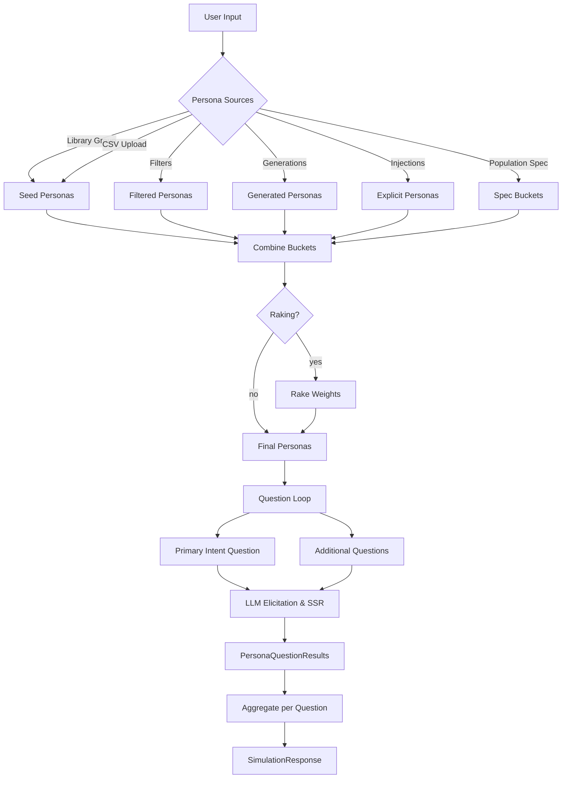

# Persona Composition & Question Flow

This note explains how personas are assembled at runtime, how the newer
features (filters, prompt-based generation, injections, population specs,
and raking) work together, and how questions flow through the pipeline.

## Persona Building Blocks

1. **Library Personas** – Selecting a `persona_group` seeds the request with
   the weighted personas defined in `src/ssr_service/data/personas/*.yml`.
   Each YAML entry carries a weight, metadata, and descriptive text.
2. **Persona Filters** – Expressions such as
   `group=us_toothpaste_buyers;include.age=25-44;share=0.4` slice personas
   from a library group (or the entire library when `group` is omitted).
   Matching personas are copied into the request and normalized to the
   optional `weight_share` (`share` alias). Multiple filters accumulate.
3. **Persona Generation Prompts** – Structured prompts create new personas on
   the fly. Each entry supports `prompt`, optional `count`, `strategy`
   (`heuristic` or `openai`), attribute overrides (`attr.region=US`,
   etc.), and `weight_share`. Generated personas behave like any other
   bucket.
4. **Persona Injections** – Explicit persona definitions (JSON, file path, or
   `name=Custom;descriptors=loyal,premium;share=0.2`) provide precise control
   over a segment. The injection can claim part of the audience via
   `weight_share`.
5. **Population Spec** – A higher-level YAML/JSON bundle that can include
   everything above plus a `base_group`, `persona_csv_path`, and `marginals`
   for raking. The spec is evaluated after request-level knobs so you can
   define reusable audiences.

The orchestrator merges personas in this order:

1. explicit `personas` on the request
2. `persona_csv`
3. `persona_group`
4. request-level injections, filters, generations
5. population spec buckets (base group, CSV path, filters, generations,
   injections)

`weight_share` values reserve part of the final audience for a bucket; the
remainder is distributed proportionally across the unsliced buckets. If a
population spec enables raking, the final weights are adjusted to match the
target marginals (lenient mode ignores missing categories; strict mode raises
if a target category has zero personas).

### Example Population Spec

```yaml
base_group: us_toothpaste_buyers
filters:
  - group: us_toothpaste_buyers
    include: { age: [25-44] }
    weight_share: 0.4
generations:
  - prompt: Eco-conscious professionals
    count: 2
    weight_share: 0.3
    attributes: { region: US }
injections:
  - persona:
      name: Loyal Subscriber
      descriptors: [subscription, auto-ship]
      weight: 1.0
    weight_share: 0.2
marginals:
  age: { "25-44": 0.5, "45-64": 0.5 }
raking:
  enabled: true
  mode: lenient
  iterations: 20
```

This yields:

- 40% filtered from the base group
- 30% generated eco-conscious personas
- 20% explicit “Loyal Subscriber”
- 10% remainder from the base group
- Raking refines the weights to the 50/50 age split.

## Question & Simulation Flow

Users can supply additional questions (`questions` list or the Gradio UI’s
“Additional Questions” field). The orchestrator always runs the primary
question (default or `intent_question`) first, then iterates over the extra
questions. Each iteration reuses the personas and weights, gathers fresh
LLM rationales, and stores per-question persona results plus aggregate
metrics.



Key outputs:

- `SimulationResponse.aggregate` – aggregate Likert distribution for the
  primary question.
- `SimulationResponse.questions[]` – per-question aggregates for additional
  prompts.
- `PersonaResult.question_results[]` – per-persona distributions, rationales,
  and themes per question.
- `metadata` – includes `persona_total`, `question_count`, allocation logs,
  and raking info when applicable.

## Quick Reference

- Use `make gradio` to launch the UI (reads `.env`, checks
  `OPENAI_API_KEY`, sets `AGENT_MODE` if missing).
- Use `make check` before pushing to keep lint/type/security gates green.
- For reproducible audiences, prefer a population spec YAML (stored in repo
  or elsewhere) so you can rerun the same slices/raking in CI.
